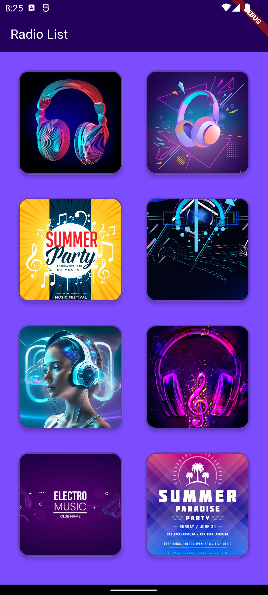
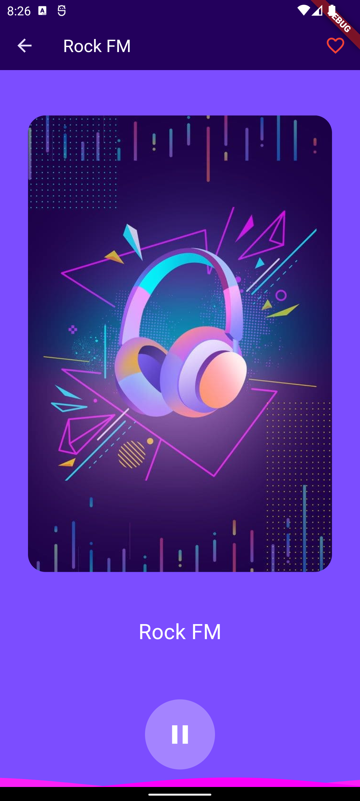
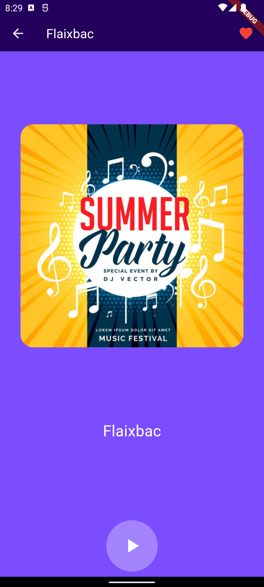

# Flutter Music Radio App

A Flutter app for streaming music radio channels.

## Table of Contents

- [Getting Started](#getting-started)
    - [Prerequisites](#prerequisites)
    - [Installation](#installation)
- [Usage](#usage)
- [Features](#features)
- [Screenshots](#screenshots)
- [Contributing](#contributing)
- [License](#license)

## Getting Started

### Prerequisites

Before you begin, make sure you have the following installed:

- [Flutter SDK](https://flutter.dev/docs/get-started/install)
- [Dart SDK](https://dart.dev/get-dart)

### Installation

1. **Clone the repository:**

   ```bash
   git clone git@github.com:tonistayhungrystayfoolish/rapioAppFlutter.git

Navigate to the project directory:
cd music_radio_toni

Install dependencies:
flutter pub get

Usage
flutter run

Features

    Stream music from various radio channels.
    Toggle favorite channels.

Screenshots





